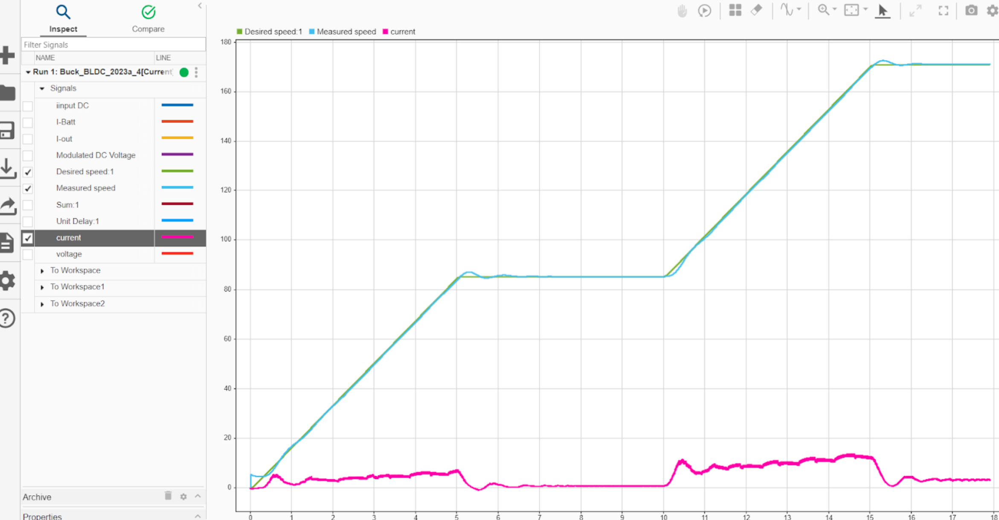

# Failure Modes and Effects Analysis: An Experience from the E-Bike Domain

## Step 1: Approach to the Model

- Open the Simulink model from the corresponding folder:
  - For the original model, open the `Buck_4` folder. Model path: *Buck_4/Buck_BLDC_2023a_4.slx*
  - For the mitigation version, use: *Buck_4_Mitigation/Buck_BLDC_2023a_4.slx*

## Step 2: Inserting a Fault

To insert a fault, with the model open, select the point where you want to insert the fault, then click on the *lightning bolt icon*, and insert the fault as shown in the picture below:

  

Once the fault has been inserted, the **Fault Properties** opens:

You can select:
- The *fault name*
- The *fault library* (we used `mvfaultlib`, the standard library provided by MathWorks)
- The *fault behavior* (either selected from the predefined options, or defined as a custom behavior)
- The *Trigger Type*

When a new fault is created, then there is also generated a separate fault model file. This file has the same name as the original model file, with `_FaultModel` added to its name. *(e.g., `Buck_4/Buck_BLDC_2023a_4_FaultModel.slx`)*

-  If no faults have been added yet, the fault model file is created
-  If the file already exists, it is updated with the new fault
-  The fault model file contains all the faults associated with the original model
  
Once everything is done, the *Fault Table* automatically opens and displays all the faults and the conditions that have been created.

When the 'trigger type' has to be selected, you have to choose between *timed* or *conditional*. If **conditional** is chosen, then a condition must be defined. 

To insert a new *condition*, you have to: 
- Take the fault table, here you can modify the *fault list* or the *conditional list*, consider the **Conditional List**, and add the condition you want using the *green cross*
- Once you've added the condition, you have to link the condition to the fault through the *property inspector* under the *fault* part

## Step 4: Creating a Condition
To define additional conditions, you have to click on the **"+"** button in the top-left corner of the Fault Table. Each condition can then be edited through the Property Inspector.

Once the condition is defined, through the Property Inspector, we can access the following elements:
- **Name**: The name of the fault condition.
- **Condition Expression**: The logical expression that, when evaluated as true, triggers
the fault. (e.g., speed >= 50)
- **Symbol Table**: A table listing all the variables involved in the condition.

Thanks to the symbol table, it is possible to define the source for the value of each variable.
Two options are available:
- **Expression**: Assigning a value using a standard expression.
- **Model Element**: Retrieve the value from a specific model element. In this case, the user can select an element of the model (e.g., the output of a signal). Once selected, the value is automatically set to match that element.

## Step 4: Fault Management
To switch between faults, we can use the **Fault Table**

From this table, the user must select the position of the model where the fault has to be applied. Note: Only one position can be selected at a time.
The fault properties can be edited through the Property Inspector; It is also possible to apply a different fault to the same position.
Once the simulation is started, it will run using the currently selected faults.

## Step 5: Simulation

To run the simulation, press the **Run** button. The simulation must be executed in **Normal mode** if at least one fault is present.
After clicking Run, the user must wait for the simulation to start. It will take a while, depending on the model, the faults applied, and on your computer.
To observe the effects of the fault during simulation, there are two main tools:
### - Scope
Displays the fault’s impact graphically over time. It is useful for tracking specific signals.

### - Data Inspector
This tool allows the user to inspect all model signals generated during
each simulation. On the left side, you can see all the previously run simulations, enabling easy comparison across different runs. This is the most suitable tool for a comprehensive analysis of the simulation results.

---

### 🔗 [GitHub Repository](https://github.com/foselab/SimulationDrivenFMEA_Bikes)

