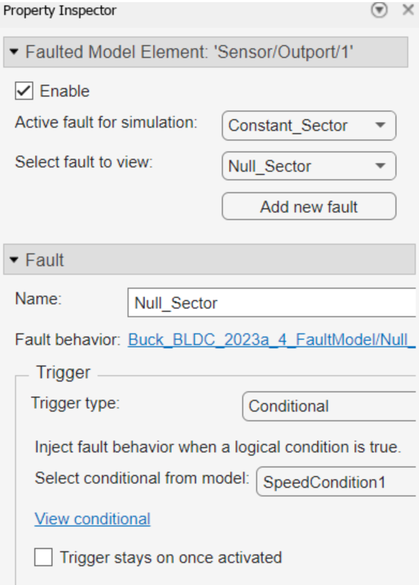
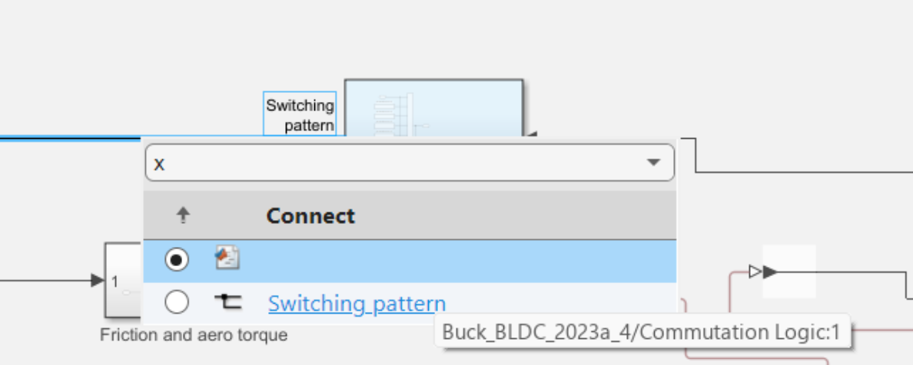

# Failure Modes and Effects Analysis: An Experience from the E-Bike Domain

## Step 1: Approach to the Model

- Open the Simulink model from the corresponding folder:
  - For the original model, open the `Buck_4` folder. Model path: *Buck_4/Buck_BLDC_2023a_4.slx*
  - For the mitigation version, use: *Buck_4_Mitigation/Buck_BLDC_2023a_4.slx*

## Step 2: Inserting a Fault

To insert a fault, with the model open, select the point where you want to insert the fault, then right-click and insert the fault:

## Step 2: Inserting a Fault

To insert a fault, with the model open, select the point where you want to insert the fault, then right-click and insert the fault:

Once the fault has been inserted, the **Property Inspector** opens:

You can select:
- The fault name
- The library (we used `mvfaultlib`)
- The fault behavior (predefined or custom)

When a fault is created, a separate fault model file is generated.  
It has the same name as the original model, with `_faultmodel` added.  
Example: `Buck_4/Buck_BLDC_2023a_4_faultmodel.slx`

- If no faults exist, the file is created
- If it exists, it's updated
- It includes all faults linked to the model

Finally, select the trigger type.  
If **conditional**, define a condition.

The **Fault Table** then opens and displays all created conditions.

## Step 3: Creating a Condition

To define more conditions:
- Click the **"+"** in the Fault Table
- Use the Property Inspector to edit

You can configure:

- **Name**: of the condition
- **Condition Expression**: e.g., `speed >= 50`
- **Symbol Table**: lists all involved variables

Variable value source:
- **Expression**: Set value via expression
- **Model Element**: Extract from a model signal

## Step 4: Fault Management

Use the **Fault Table** to switch between faults.

- Select where the fault applies (only one at a time)
- Edit properties via the Property Inspector
- You can apply a different fault to the same point

The simulation will run using the selected faults.

## Step 5: Simulation

To run the simulation, click **Run**.  
> If at least one fault is present, run in **Normal** mode.

Wait for the simulation to start. Duration depends on:
- The model
- Faults
- Your machine

To observe the fault’s effect:

### - Scope

Graphically shows signal changes over time.

### - Data Inspector

Allows inspection of all simulation signals.  
You can compare signals across multiple runs.

---

### 🔗 [GitHub Repository](https://github.com/foselab/SimulationDrivenFMEA_Bikes)

