# Failure Modes and Effects Analysis: An Experience from the E-Bike Domain

This repository contains the necessary files to replicate the experiments described in the *Failure Modes and Effects Analysis: An Experience from the E-Bike Domain* paper. The experiments involve using the Simulink® Fault Analyzer tool and Simulink models to evaluate model safety against faults.

## Repository Folders

This repository contains a folder called `Replication_Package`.
The folder contains:

- two Simulink models (one including only faults, and one including mitigation strategies).
- all figures used in the paper and reporting the simulation results with all the analyzed faults.
- the transcripts of the structured interview we conducted with our domain expert.

## Requirements

To run the experiments and be able to open the Simulink models, ensure the following software is installed:

- [MATLAB](https://it.mathworks.com/products/matlab.html?requestedDomain) version R2024a or newer (we used R2024a Update 5 - 24.1.0.2653294) and the following Add-Ons:
 - Simulink
  - Simulink Test
  - Simscape Electrical (Simscape)
  - Parallel Computing Toolbox
  - Simulink Fault Analyzer R2024a v24.1

## Step 1: Approach to the Model

- Open the Simulink model from the corresponding folder:
  - For the original model, open the `Buck_4` folder. Model path: *Buck_4/Buck_BLDC_2023a_4.slx*
  - For the mitigation version, use: *Buck_4_Mitigation/Buck_BLDC_2023a_4.slx*

## Step 2: Inserting a Fault

To insert a fault, with the model open, select the point where you want to insert the fault, then click on the *lightning bolt icon*, and insert the fault as shown in the picture below:

  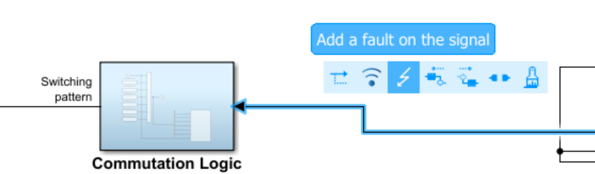

Once the fault has been inserted, the **Fault Properties** opens:

You can select:
- The *fault name*
- The *fault library* (we used `mvfaultlib`, the standard library provided by MathWorks)
- The *fault behavior* (either selected from the predefined options, or defined as a custom behavior)
- The *Trigger Type*

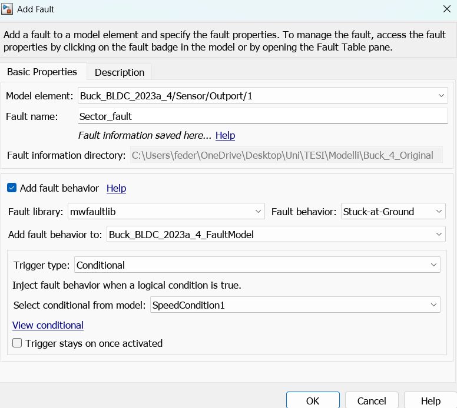

When a new fault is created, a separate fault model file is also generated. This file has the same name as the original model file, with `_FaultModel` added to its name. *(e.g., `Buck_4/Buck_BLDC_2023a_4_FaultModel.slx`)*

-  If no faults have been added yet, the fault model file is created
-  If the file already exists, it is updated with the new fault
-  The fault model file contains all the faults associated with the original model

Note: It could happen (after a certain number of faults) that it will not be allowed anymore to add new faults to the *FaultModel* file; In that scenario, you have to create a new file to add more faults

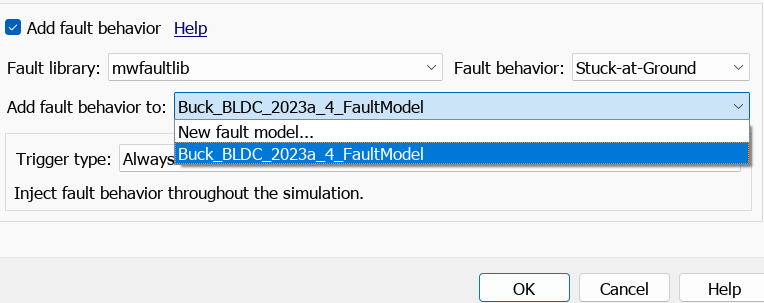

Once everything is done, the *Fault Table* automatically opens and displays all the faults and the conditions that have been created.

Note: If the Fault Table does not open automatically, you can open it manually by clicking on the corresponding icon in the top toolbar

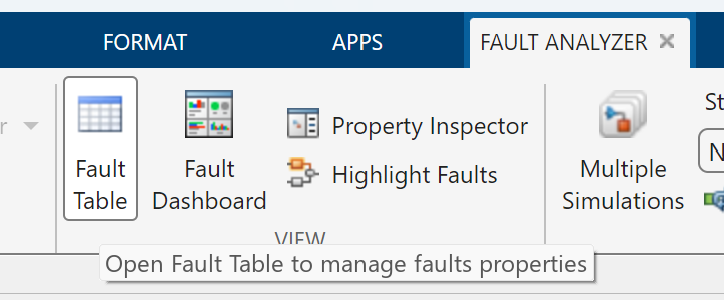

When the 'trigger type' has to be selected, you have to choose between *timed* or *conditional*. If **conditional** is chosen, then a condition must be defined. 

To insert a new *condition*, you have to: 
- Take the fault table, here you can modify the *fault list* or the *conditional list*, consider the **Conditional List**, and add the condition you want using the *green cross*
- Once you've added the condition, you have to link the condition to the fault through the *property inspector* under the *fault* part

## Step 3: Creating a Condition
To define additional conditions, you have to click on the **"+"** button in the top-left corner of the Fault Table. Each condition can then be edited through the Property Inspector.

Once the condition is defined, through the Property Inspector, we can access the following elements:
- **Name**: The name of the fault condition.
- **Condition Expression**: The logical expression that, when evaluated as true, triggers
the fault. (e.g., speed >= 50)
- **Symbol Table**: A table listing all the variables involved in the condition.

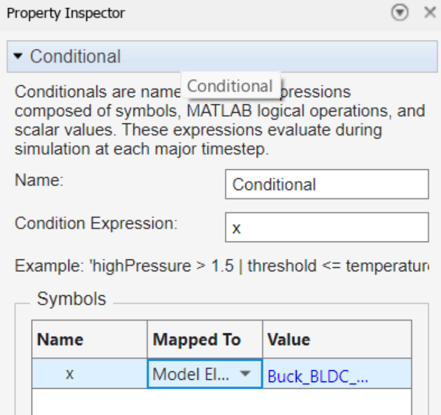

Thanks to the symbol table, it is possible to define the source for the value of each variable.
Two options are available:
- **Expression**: Assigning a value using a standard expression.
- **Model Element**: Retrieve the value from a specific model element. In this case, the user can select an element of the model (e.g., the output of a signal). Once selected, the value is automatically set to match that element.

## Step 4: Fault Management
To switch between faults, we can use the **Fault Table**

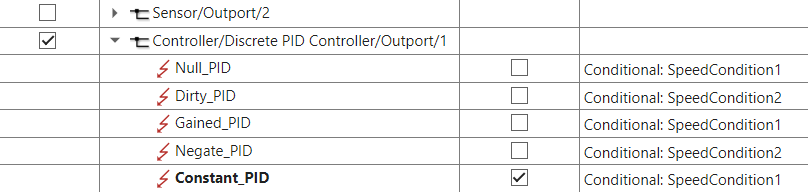

From this table, the user must select the position of the model where the fault has to be applied. Note: Only one position can be selected at a time.
The fault properties can be edited through the Property Inspector; It is also possible to apply a different fault to the same position.
Once the simulation is started, it will run using the currently selected faults.

## Step 5: Simulation

To run the simulation, press the **Run** button. The simulation must be executed in **Normal mode** if at least one fault is present.
After clicking Run, the user must wait for the simulation to start. It will take a while, depending on the model, the faults applied, and on your computer.
To observe the effects of the fault during simulation, there are two main tools:

### - Scope
Displays the fault’s impact graphically over time. It is useful for tracking specific signals.

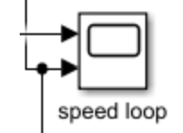

### - Data Inspector
This tool allows the user to inspect all model signals generated during
each simulation. On the left side, you can see all the previously run simulations, enabling easy comparison across different runs. This is the most suitable tool for a comprehensive analysis of the simulation results.

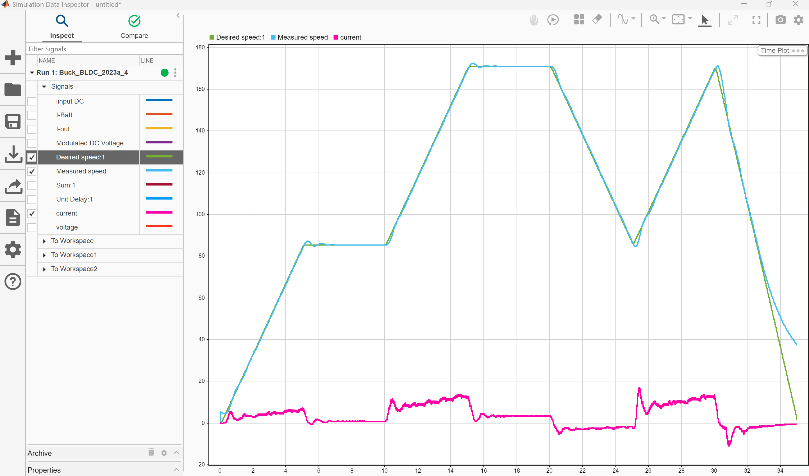

## Our Experiment
If you're interested in replicating our work, you have to go through the following steps:

1. Opening the model in the Buck_4 folder, model path: *Buck_4/Buck_BLDC_2023a_4.slx*
   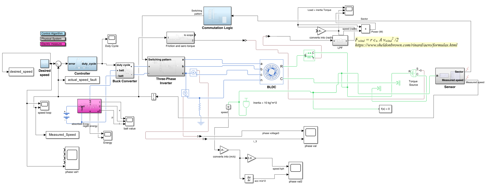
   
2. You can see the fault we inserted in the fault table.
- Open the fault table through the toolbar at the top of the program (select "APPS" -> "Fault Analyzer" -> "fault table")

- Once the fault table is open, you should see the following faults
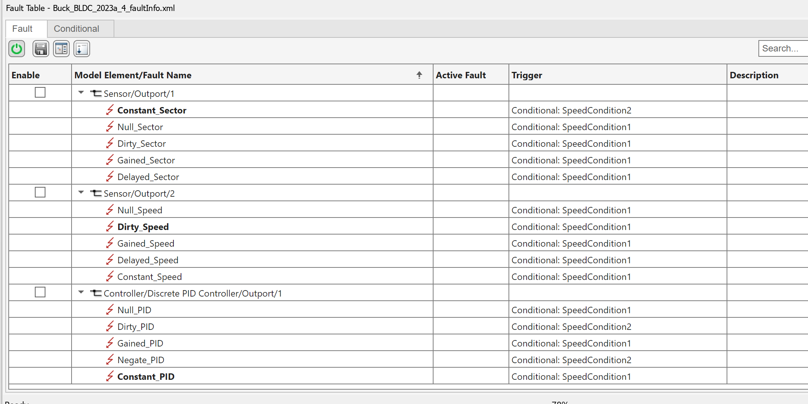

3. To run the simulation, you have to press the "run" button at the top of the screen, under the "SIMULATE" part of the "Fault Analyzer" tool
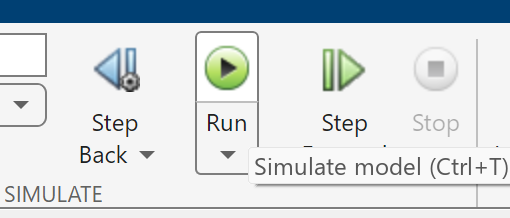

4. Once the simulation is done, you are able to see the results:
- Press the *Data Inspector* button
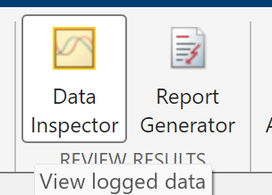

- See and compare the results of the simulation

---
## Contributors

The following authors contributed to the _Failure Modes and Effects Analysis: An Experience from the E-Bike Domain_ paper:

- _Federico Conti_, University of Bergamo, Italy
- _Andrea Bombarda_, University of Bergamo, Italy
- _Marcello Minervini_, University of Bergamo, Italy
- _Aurora Francesca Zanenga_, University of Bergamo, Italy
- _Claudio Menghi_, University of Bergamo, Italy and McMaster University, Canada

